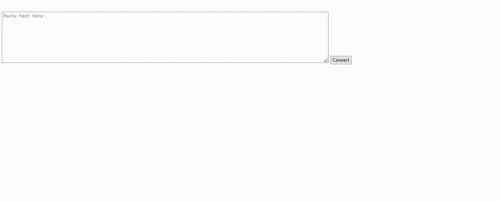

<p>Clarusway</p>

# JS-CC-01 : Capital Letters

Create a function that takes the text from a textarea and converts it such that the first letter of each word is capitalized, except for certain small words (e.g., "a", "an", "the", "and", "but", etc.). The conversion should be triggered by clicking a button, and the result should be displayed in a paragraph element.


## Expected Outcome
```
There Are Many Variations of Passages of Lorem Ipsum Available, but the Majority Have Suffered Alteration in Some Form, by Injected Humour, or Randomised Words Which Don't Look Even Slightly Believable. If You Are Going to Use a Passage of Lorem Ipsum, You Need to Be Sure There Isn't Anything Embarrassing Hidden in the Middle of Text. All the Lorem Ipsum Generators on the Internet Tend to Repeat Predefined Chunks as Necessary, Making This the First True Generator on the Internet. It Uses a Dictionary of Over 200 Latin Words, Combined with a Handful of Model Sentence Structures, to Generate Lorem Ipsum Which Looks Reasonable. the Generated Lorem Ipsum is Therefore Always Free From Repetition, Injected Humour, or Non-characteristic Words Etc.
```
​


## Learning Outcomes

By completing this code challenge, participants will achieve the following learning outcomes:

- String Manipulation
- Array Handling
- Conditional Logic
- Functions and Scope
- Event Handling in JavaScript
- DOM Manipulation
- Write clean, readable, and maintainable code by following best practices in function naming, code organization, and commenting.
- By achieving these learning outcomes, participants will strengthen their understanding of fundamental JavaScript concepts and improve their ability to build interactive web applications.

## Problem Statement

- The first and last words of the text should always be capitalized.
- Small words should only remain lowercase if they appear in the middle of the text.
- All other words should start with a capital letter.

### Sample Input
```
There are many variations of passages of Lorem Ipsum available, but the majority have suffered alteration in some form, by injected humour, or randomised words which don't look even slightly believable. If you are going to use a passage of Lorem Ipsum, you need to be sure there isn't anything embarrassing hidden in the middle of text. All the Lorem Ipsum generators on the Internet tend to repeat predefined chunks as necessary, making this the first true generator on the Internet. It uses a dictionary of over 200 Latin words, combined with a handful of model sentence structures, to generate Lorem Ipsum which looks reasonable. The generated Lorem Ipsum is therefore always free from repetition, injected humour, or non-characteristic words etc.
```


<p align="center"> ⌛ <strong>Happy Coding </strong> ✍ </p>
